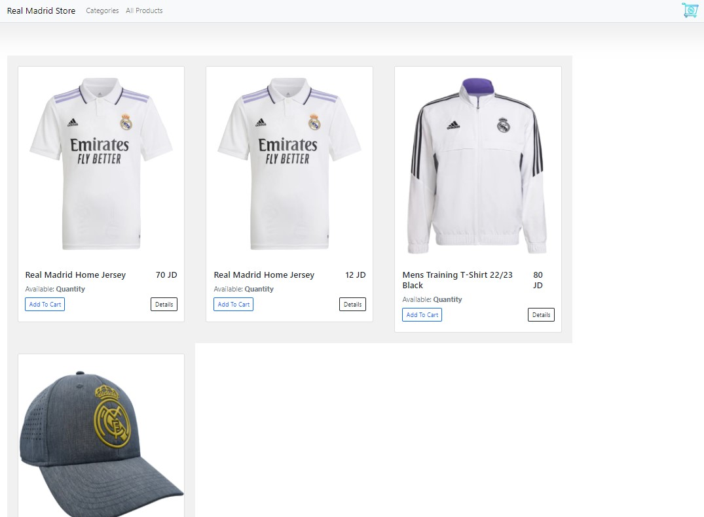

# RealMadridStore
A website that allows people to buy and sell physical goods, services, and digital products over the internet rather than at a brick-and-mortar location. Through an e-commerce website, a business can process orders, accept payments, manage shipping and logistics, and provide customer service.
## User Stories and Tasks
- As an admin user, I would like to have a dashboard where I can see a list of product categories
- As an admin user, I would like to view a detail page for each category so that I can eventually edit its data or delete it
- As an admin user, I would like to see a list of the products assigned to a category on the category details page
- As an admin user, I would like a detail page for each product so that I can eventually edit its data or delete it
- As an administrator I would like add and save a new category so that I can expand my product lines
- As an administrator I would like add and save a new product so that I can expand my inventory
- As an administrator I would like to associate a product to a category so that my users can more easily browse our inventory
- As an administrator I would like to be able to delete products and categories as needed
- As an administrator I would like to be able to edit/modify categories so that I can change my storefront structure in real time
- As an administrator I would like to be able to edit/modify products so that I can change my inventory in real time
- As the site owner, I would like to secure the admin dashboard so that only users with an administrative role can access it
- As an administrator I would like to ensure that only users in the Administrator role can add categories or products
- As an administrator I would like to ensure that only users in the Editor permissions can modify categories or products
- As an administrator I would like to ensure that only users in the Editor permissions can add a product to a category
- As an administrator I would like to ensure that only users in the Administrator permissions can delete categories or products
## Home Page
---

 
## Products Page
---

 
## Product Details Page
---

 
## Cart Page
---

 